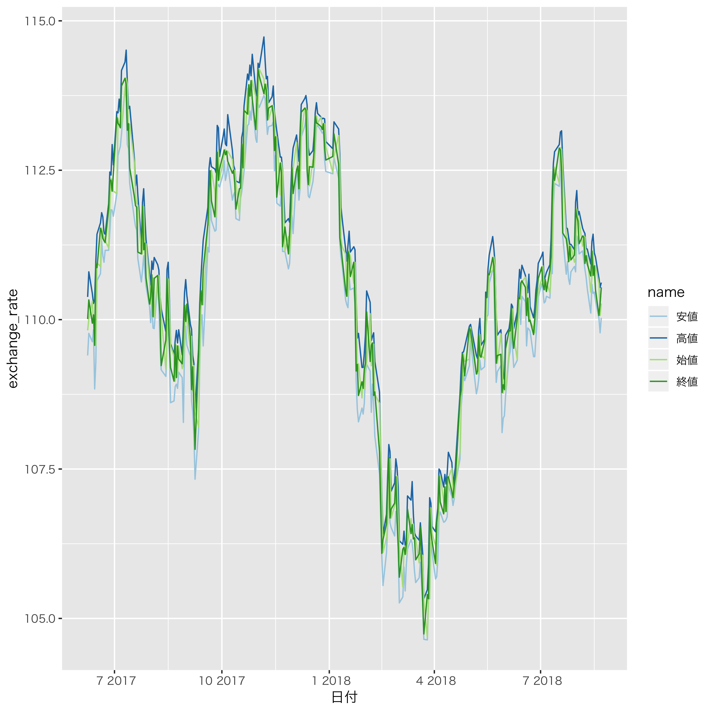

```{r setup, include=FALSE}
knitr::opts_chunk$set(echo = TRUE)
```

# 今日やったことまとめ

今日は基本的に、dplyr, tidyrによるtidy dataの作り方の続きからスタートし、ggplot2, RMarkdownの導入を行った。
本を終えたので、昨日勉強したスクレイピングで取得した為替データを整形し、ggplot2で出力するところまで行った。
一先ず、スクレイピングでつまづいた箇所をまとめておく。

本日使ったパッケージはこちら
```{r package, echo=F, warning=F, message=F}
library(tidyverse)
library(rvest)
library(readr)
library(RColorBrewer)
```

[カブタン](https://kabutan.jp/stock/kabuka?code=0950)からデータを取得してくるのは本とほぼ同様で、
chromeの検証機能を使ってXPathを取得し、貼り付けた。次回以降の利用を考え関数としてまとめた。

#### データ取得の関数
```{r function}
# 連番のURL取得
renban_url <- function(base_url, n){
  urls <- NULL
  for (i in 1:n){
    pgnum <- as.character(i)
    urls[i] <- paste0(base_url, pgnum)
  }
  return(urls)
}

# 連番URLを入れると、表をダウンロードする
renban_dl <- function(base_url, n, XPath = '//*[@id="stock_kabuka_table"]/table[2]'){
  urls <- renban_url(base_url, n)
  kawases <- list()
  for (i in 1:n){
    memory <- read_html(urls[i]) %>% 
      html_nodes(xpath = XPath) %>% 
      html_table() %>% 
      as.data.frame() %>% 
      dplyr::mutate_at("前日比", as.numeric) %>% 
      dplyr::mutate_at("前日比.", as.numeric) 
    memory[,"日付"] <- parse_date(memory[, "日付"], "%x")
    kawases[[i]] <- memory
    Sys.sleep(0.5)
  }
  return(kawases)
}

```

上の関数で、`renban_dl`で本と大きく変えている点は、  
- "前日比"の型が数値型になっている点  
- "日付"を文字列型ではなく、POSIXctに変換してから取得している点  
である。最後に、これについてまとめておく。

これで、スクレイピングの処理は書けたので動かしてみると以下のようになる。
```{r, eval = F}
kawases_url <- "https://kabutan.jp/stock/kabuka?code=0950&ashi=day&page="
dat <- renban_dl(kawases_url, 10)
data <- list()
data <- dplyr::bind_rows(dat)
write_csv(data, "kawase/kawase.csv")
font <- "HiraKakuPro-W3"
ggplot(data = data, family = font) +
  geom_line(mapping = aes(x = 日付, y = 終値)) +
  theme(text = element_text(family = font)) +
  scale_fill_brewer(palette = "Paired")
```
しかし、これではtidy dataになっていないので、プロットする時もY軸に終値・高値・安値・始値を
取らなくてはならない。これを、４種類の値段ごとに色分けして一つのプロットの中に描画する事が
一応今日の目標であった。  
tidyな形に直してみると、このようになって、４つの値段の名前をkeyにしてlong formにすることができた。
```{r, eval = F}
d <- data %>% 
  dplyr::select(日付:終値)
data_tidy <- gather(d, key = "name", value = "exchange_rate",
                    始値,高値,安値,終値)
ggplot(data = data_tidy, family = font) +
  geom_line(mapping = aes(x = 日付, y = exchange_rate, colour = name)) +
  theme(text = element_text(family = font)) +
  scale_colour_brewer(palette = "Paired")
```
plotした結果を貼ると



## 型を揃えてtibbleを連結する

最後に、今回少し苦労した変換の方法についてまとめておく。  
まず、"前日比","前日比."のカラムには基本的に数値で入っているが、10ページ目には文字列で入っていた。
それは、一番最初の日付には前日のデータが存在しないためにハイフンが含まれていたからだと思われる。
その為、これは無視して`as.numeric()`に代入すれば、最終行以外はすんなり数値型にしてくれて、最終行は
NAで処理してくれる。

## 文字列型で書かれた日付をPOSIXctに変換する方法
そして、１番重要な文字列型の日付を直す方法であるが、今回使った*parse_date(x, format = "")*は**readr**パッケージに入っている。  
xにベクトルを入れて、formatで文字列がどういう規則で日付を表しているかを指定している。具体的には  
- Year: "%Y" (4 digits). "%y" (2 digits); 00-69 -> 2000-2069, 70-99 -> 1970-1999.

- Month: "%m" (2 digits), "%b" (abbreviated name in current locale), "%B" (full name in current locale).

- Day: "%d" (2 digits), "%e" (optional leading space)

- Hour: "%H" or "%I", use I (and not H) with AM/PM.

- Minutes: "%M"

- Seconds: "%S" (integer seconds), "%OS" (partial seconds)

- Time zone: "%Z" (as name, e.g. "America/Chicago"), "%z" (as offset from UTC, e.g. "+0800")

- AM/PM indicator: "%p".

- Shortcuts: "%D" = "%m/%d/%y", "%F" = "%Y-%m-%d", "%R" = "%H:%M", "%T" = "%H:%M:%S", "%x" = "%y/%m/%d".

というような形で、指定している。今回は18/08/23というような形式だったので`"%y/%m/%d"`または`"%x"`というformatになった。
その他の関数については[このサイト](https://heavywatal.github.io/rstats/readr.html)が参考になる。

